# Bude Suite — Backend (`bude_api`)

Copyright (C) 2026 [Bude Global Enterprises](https://www.budeglobal.in/). Licensed under the [GNU GPLv3](LICENSE). Developed by [Aravind Govindhasamy](https://aravind-govindhasamy.github.io/). See [CONTRIBUTORS.md](CONTRIBUTORS.md).

Server-side extension for an ERPNext / Frappe site. Exposes whitelisted API methods that the Bude mobile app suite calls; **never** modifies ERPNext standard DocTypes.

Bude Suite is a mobile-first companion for ERPNext: four native Flutter apps
(Inventory, HR, Sales, Helpdesk) covering RFID/barcode stock operations,
attendance and leave, field sales and CRM, and ticketing — all working
offline-first and syncing back to standard ERPNext documents. **This
repository is the API layer those apps talk to.** No custom DocTypes, no
proprietary data layer: every mutation lands on a standard ERPNext record.

## Product preview

*Reference design mockups, not screenshots of the shipped app — the actual
screens may differ. Fictional data throughout: no real customer, employee,
or business records. Shown to illustrate the UI this API layer is built to
power.*

### Inventory

<table>
<tr>
<td align="center" width="20%">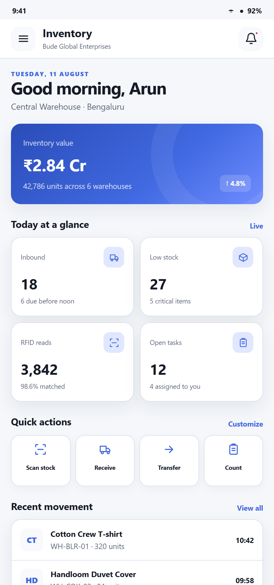<br><sub>Dashboard</sub></td>
<td align="center" width="20%">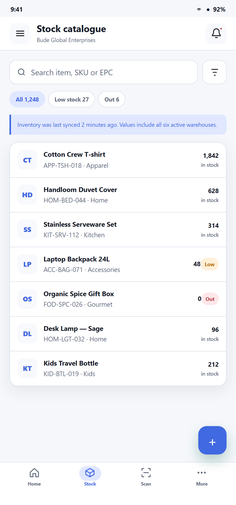<br><sub>Stock catalogue</sub></td>
<td align="center" width="20%">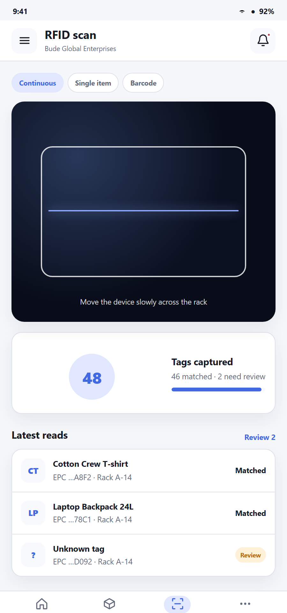<br><sub>RFID scan</sub></td>
<td align="center" width="20%">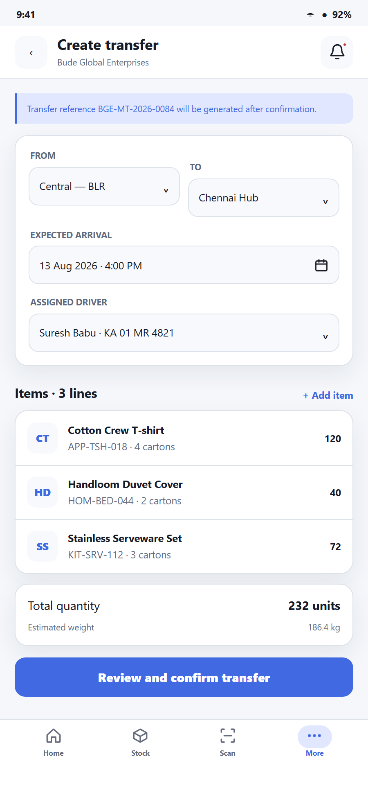<br><sub>Stock transfer</sub></td>
<td align="center" width="20%">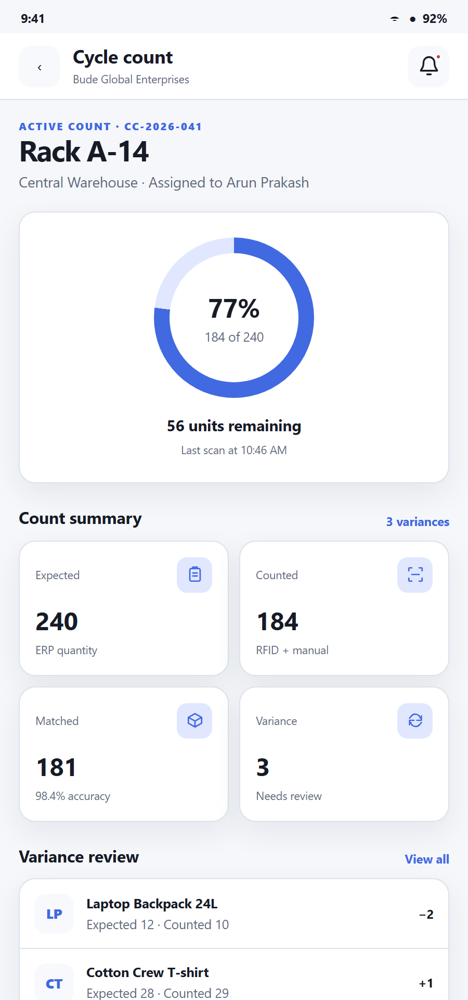<br><sub>Cycle count</sub></td>
</tr>
</table>

### HR

<table>
<tr>
<td align="center" width="25%">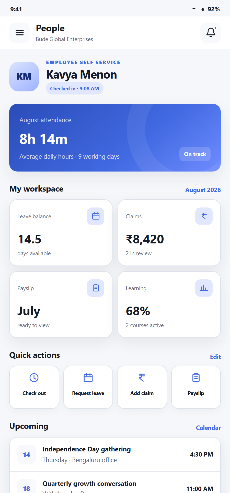<br><sub>Dashboard</sub></td>
<td align="center" width="25%">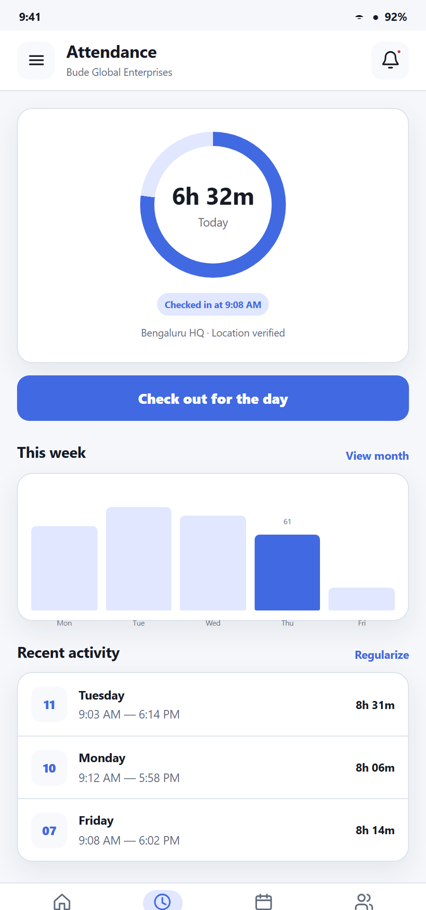<br><sub>Attendance</sub></td>
<td align="center" width="25%">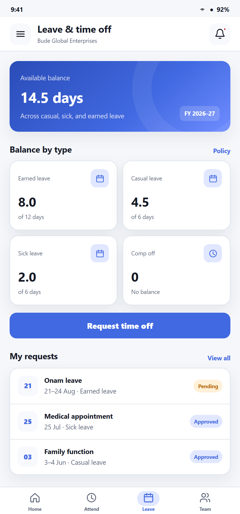<br><sub>Leave</sub></td>
<td align="center" width="25%">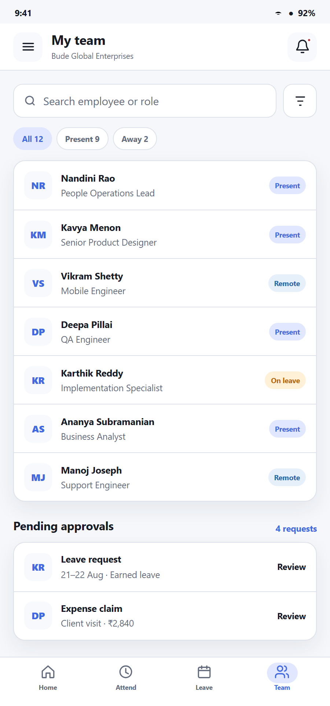<br><sub>Team</sub></td>
</tr>
</table>

### Sales

<table>
<tr>
<td align="center" width="25%">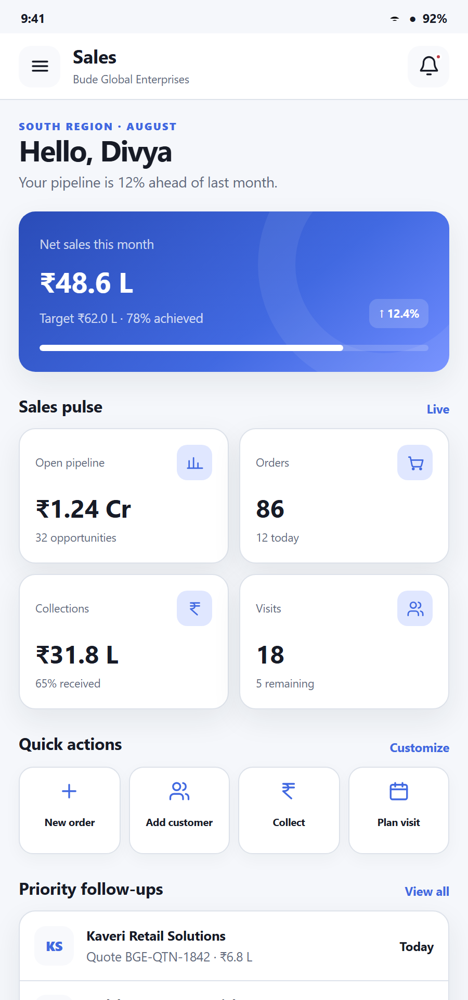<br><sub>Dashboard</sub></td>
<td align="center" width="25%">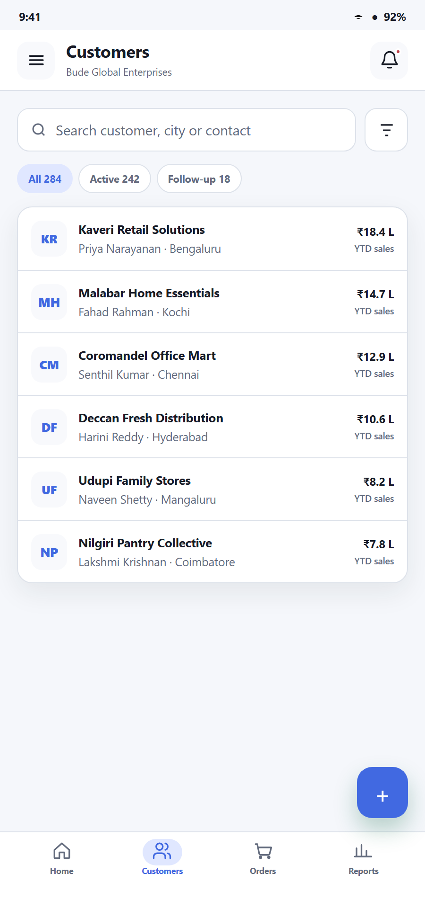<br><sub>Customers</sub></td>
<td align="center" width="25%">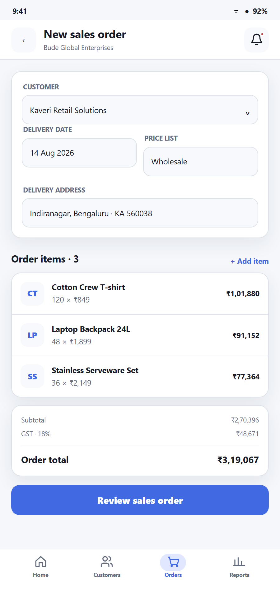<br><sub>New order</sub></td>
<td align="center" width="25%">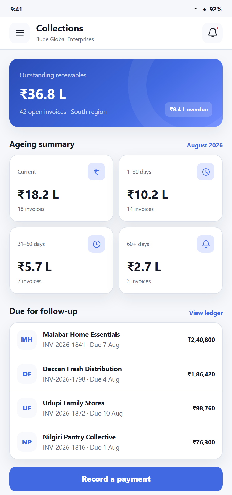<br><sub>Collections</sub></td>
</tr>
</table>

### Helpdesk

<table>
<tr>
<td align="center" width="25%">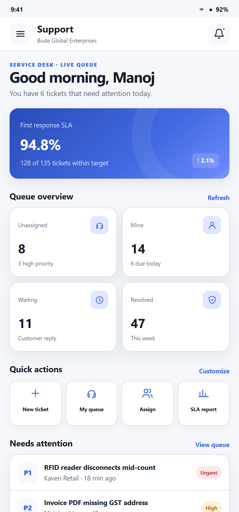<br><sub>Dashboard</sub></td>
<td align="center" width="25%">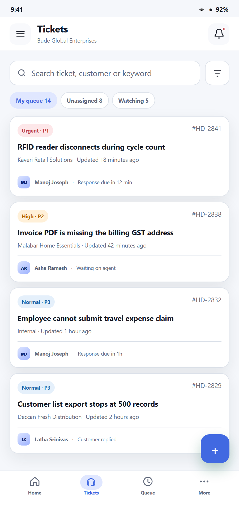<br><sub>Ticket queue</sub></td>
<td align="center" width="25%">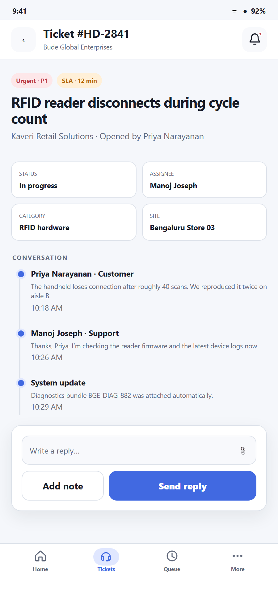<br><sub>Ticket detail</sub></td>
<td align="center" width="25%">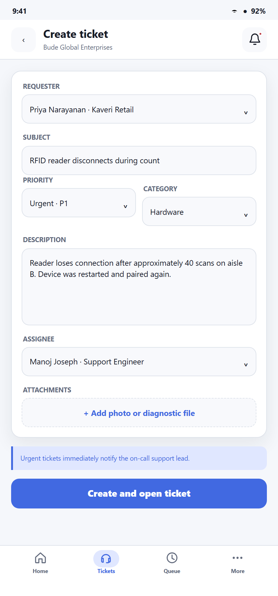<br><sub>New ticket</sub></td>
</tr>
</table>

### Sign-in & account

<table>
<tr>
<td align="center" width="25%">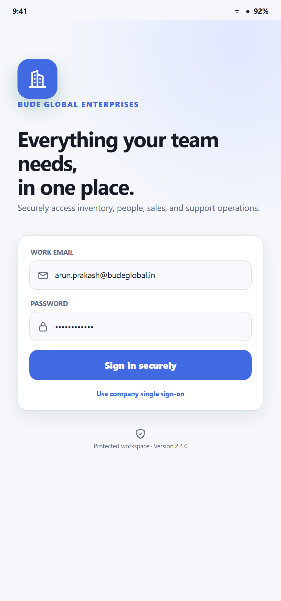<br><sub>Sign in</sub></td>
<td align="center" width="25%">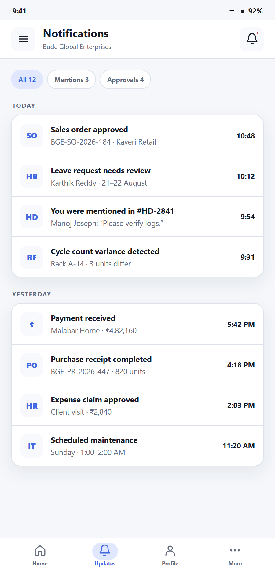<br><sub>Notifications</sub></td>
<td align="center" width="25%">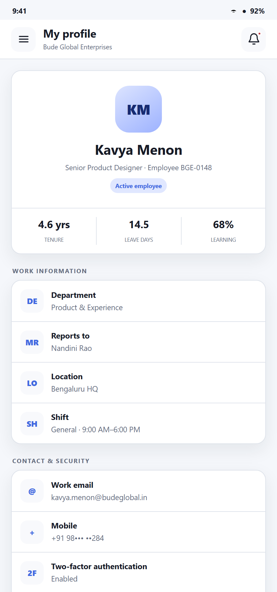<br><sub>Profile</sub></td>
</tr>
</table>

## Live demo

A public, read-only login on the pilot ERPNext site, for browsing the real
apps rather than the mockups above.

| | |
|---|---|
| Server URL | `https://erp1.budeglobal.in` |
| Username | `demo@budeglobal.in` |
| Password | `jVHoCW8igy1AvCjNBovv` |

**This account cannot write.** It holds the same operational roles a real
Stock/HR/Sales/Helpdesk user would (so the apps' navigation renders
normally), but every create, update, submit, delete and cancel is denied at
the request level regardless of what those roles would otherwise allow —
enforced in [`services/common/demo_readonly.py`](bude_api/services/common/demo_readonly.py),
independent of the roles' own permissions, so real staff holding the same
roles are unaffected. A handful of doctypes (Salary Slip, Payment Entry,
User, and a few others) are blocked from this account even for reading.
Anything not explicitly allow-listed is denied by default, including
endpoints this file doesn't know about — see that module's docstring for
what was tried first and why it didn't work.

Use it to log into the web builds below, or point a fresh install of the
mobile apps at that server URL.

## Status

Production-oriented API layer for the Bude inventory, HR, helpdesk, and sales
clients. The sales surface includes provider-neutral CRM, offline field work,
ERPNext order-to-cash, notification scheduling, and deployment diagnostics.

| Module | Purpose |
|---|---|
| `services/auth_service.py` | Wraps Frappe login/logout/session; token issuance |
| `services/erpnext_client.py` | Thin wrapper over Frappe ORM for standard DocTypes (Item, Stock Entry, Warehouse, etc.) |
| `api/health.py` | Whitelisted `ping` endpoint for client connectivity checks |
| `config/settings.py` | Reads environment + Frappe site_config values |

## Layout

```text
bude_api/
├── __init__.py
├── hooks.py                # Frappe app entrypoint
├── modules.txt
├── pyproject.toml          # package metadata for bench/pip
├── requirements.txt
├── config/
│   └── settings.py
├── services/
│   ├── auth_service.py
│   └── erpnext_client.py
├── api/
│   ├── auth.py
│   ├── health.py
│   └── items.py
├── middleware/
│   └── request_logger.py
├── utils/
│   └── response.py
└── tests/
    ├── test_auth.py
    ├── test_health.py
    └── test_items.py
```

## Install onto a Frappe bench

```bash
# from your frappe-bench directory
bench get-app bude_api https://github.com/BUDEGlobalEnterprise/bude-suite.git
bench --site <site> install-app bude_api
bench restart
```

## Calling endpoints

```
POST /api/method/login                            # Frappe built-in
GET  /api/method/bude_api.api.health.ping         # custom — returns service status
GET  /api/resource/Item?filters=[["disabled","=",0]]   # standard ERPNext REST
```

## Constraints

- No custom DocTypes.
- All persistence goes through ERPNext standard entities.
- Connectors for SAP / Zoho / other ERPs land under a future `integrations/` package using the Adapter pattern.

## Bude Sales CRM

The provider-neutral CRM API is exposed under
`/api/method/bude_api.api.sales_crm.*`. It uses standard ERPNext records by
default and can use Frappe CRM records when the optional `crm` app is installed
on the same site. A site always has one active provider; records are never
dual-written.

Add these keys to the site's `site_config.json`, then restart the bench:

```json
{
  "bude_sales_crm_enabled": 1,
  "bude_sales_crm_provider": "erpnext",
  "bude_sales_default_owner": "sales@example.com",
  "bude_sales_intake_secret": "replace-with-a-long-random-secret",
  "bude_sales_quote_response_secret": "use-a-separate-long-random-secret",
  "bude_sales_visit_max_accuracy_m": 100,
  "bude_sales_visit_geofence_m": 250,
  "bude_sales_commission_rate_percent": 2.5,
  "bude_sales_telemetry_enabled": 0,
  "bude_sales_plan": "pilot",
  "bude_sales_entitlement_status": "active"
}
```

Use `"frappe_crm"` only after installing Frappe CRM on the same site. CRM is
feature-flagged off when `bude_sales_crm_enabled` is absent. The bootstrap API
describes the provider, statuses, stages, sources, territories, writable/custom
fields, channel availability, and current-user capabilities.

Signed public intake sends compact JSON plus a current Unix `timestamp`, a hex
HMAC-SHA256 `signature` of `<timestamp>.<canonical-json>`, a channel key, and a
stable upstream `external_id`. Provider configuration, forms, email, assignment
rules, Meta, and optional WhatsApp setup remain in Frappe Desk; the mobile app
never stores connector credentials.

The CRM namespace includes bootstrap/capabilities, lead and deal CRUD,
duplicate and conversion choices, activities/timeline, tasks, private
attachments, provider-linked email, stage/outcome changes, quotation/order
handoff, analytics, manager bulk updates, connector health, and the signed
intake webhook. Mutations that can be replayed accept a stable
`client_request_id`; update operations accept `base_modified` and return a
`CONFLICT` response when the mobile revision is stale.

Attachments are stored as private standard `File` records, are permission
checked against their Lead/Opportunity/CRM parent, and are capped at 8 MB.
Outbound email creates a standard linked Communication through Frappe's mail
queue and refuses Lead records marked Do Not Contact.

Existing `Notification Log` fan-out recognizes these additional CRM
categories: lead assignment, task due/overdue, SLA breach, deal stage change,
and quotation expiry. Configure Firebase delivery and the existing device
registration endpoints to enable push transport; notification preferences are
per user.

The public `capture_intake` endpoint is for trusted server-to-server connectors
only. Keep `bude_sales_intake_secret` off every mobile client, use a fresh Unix
timestamp and stable external ID, and sign the exact canonical JSON payload.

The separate quotation-response secret signs expiring accept/decline links.
Accepted responses are written exactly once to the standard Quotation timeline;
payment links are standard ERPNext Payment Requests. Do not reuse either public
endpoint secret for another integration.

Run `bude_api.api.sales_crm.setup_doctor` after installation and upgrades. It
checks the selected provider, required DocTypes, scheduler, secrets, connector
capabilities, and role access without exposing credentials. The same report is
available to System Managers in **More > Setup doctor** in the sales app.

The scheduler calls the CRM reminder worker every 15 minutes. It creates
permission-aware `Notification Log` records for assignment, overdue follow-up,
SLA, stage, and quotation-expiry events; configured push delivery fans them out
to registered devices. Telemetry is disabled by default and, when explicitly
enabled, records only sanitized feature counters in the site's Error Log.

Field visit check-in validates GPS accuracy and optional distance from the
customer address. Offline visits remain clearly marked as unverified until
synced. Tune the two distance settings for the operating environment rather
than lowering them simply to remove validation failures.

See [the commercial pilot runbook](docs/sales/bude-sales-commercial-pilot.md)
for rollout, permissions, acceptance criteria, support, and packaging.

## More documentation

- [Product overview](docs/PRODUCT.md) — the full showcase guide covering all four apps: workflows, hardware support, demo script, training labs
- [Roadmap](docs/roadmap/inventory.md) ([V2](docs/roadmap/inventory-v2.md)) — Inventory app
- [HR roadmap](docs/roadmap/hr.md) ([V2](docs/roadmap/hr-v2.md))
- [Architecture overview](docs/architecture/overview.md) · [development guidelines](docs/architecture/development-guidelines.md) · [Hardware Abstraction Layer design](docs/architecture/hal-design.md) · [service-cloud architecture](docs/architecture/bude_service_cloud_architecture.md) · [4-app ERPNext usability audit](docs/architecture/four-app-erpnext-usability-audit.md)
- [API standards](docs/api-specifications/api-standards.md)
- [Hardware integration roadmap](docs/hardware-roadmap/integration-roadmap.md)
- [Helpdesk market roadmap](docs/helpdesk/market-roadmap.md) and release notes: [0.3](docs/helpdesk/release-0.3.md) · [0.4](docs/helpdesk/release-0.4.md) · [0.5](docs/helpdesk/release-0.5.md)
- [Field sales market roadmap](docs/sales/field-sales-market-roadmap.md) · [commercial pilot runbook](docs/sales/bude-sales-commercial-pilot.md)
- [UI continuation notes](docs/ui/UI_CONTINUATION.md)
