# Bude Suite — Backend (`bude_api`)

[](https://github.com/BUDEGlobalEnterprise/bude-suite/releases/latest)
[](https://github.com/BUDEGlobalEnterprise/bude-suite/releases)
[](LICENSE)
[](https://erpnext.com/)
[](#product-preview)
[](#status)
[](docs/PRODUCT.md)
[](#live-demo)

Copyright (C) 2026 [Bude Global Enterprises](https://www.budeglobal.in/). Licensed under the [GNU GPLv3](LICENSE). Developed by [Aravind Govindhasamy](https://aravind-govindhasamy.github.io/). See [CONTRIBUTORS.md](CONTRIBUTORS.md).

Server-side extension for an ERPNext / Frappe site. Exposes whitelisted API methods that the Bude mobile app suite calls; **never** modifies ERPNext standard DocTypes.

Bude Suite is a mobile-first companion for ERPNext: four native Flutter apps
(Inventory, HR, Sales, Helpdesk) covering RFID/barcode stock operations,
attendance and leave, field sales and CRM, and ticketing — all working
offline-first and syncing back to standard ERPNext documents. **This
repository is the API layer those apps talk to.** No custom DocTypes, no
proprietary data layer: every mutation lands on a standard ERPNext record.

---

## Key Features

- 📦 **Inventory** — RFID / barcode scanning, stock transfers, cycle counts, warehouse dashboards
- 👥 **HR** — Attendance check-in/out, leave requests, team management
- 💼 **Sales & CRM** — Provider-neutral CRM, offline field visits, order-to-cash, quotation workflows
- 🎫 **Helpdesk** — Ticket queue, SLA tracking, assignment & notifications
- 🔌 **Offline-first** — Sync back to standard ERPNext documents when connectivity returns
- 🔒 **Zero custom DocTypes** — All persistence through standard ERPNext entities

---

## The 4 Applications

Bude Suite delivers four focused native Flutter mobile apps built for field and warehouse operations. Each app communicates with standard ERPNext entities through `bude_api` without requiring custom DocTypes:

### 📦 1. Bude Inventory
- **Purpose:** Full-featured warehouse stock management for handhelds and smartphones.
- **Key Capabilities:**
  - Barcode and UHF RFID tag scanning (Chainway, Zebra, Urovo, and generic BLE readers via Hardware Abstraction Layer).
  - Inter-warehouse stock transfers with bin, rack, and shelf child warehouse selection.
  - Goods Receipt against open Purchase Orders or ad-hoc intake.
  - Physical cycle counting and stock reconciliation with automatic variance calculation.
  - Tracking allocations for Batches, Serial Numbers, and expiry dates.
  - Built-in ZPL and PDF thermal label generation.
- **Primary ERPNext DocTypes:** `Item`, `Stock Entry`, `Purchase Receipt`, `Stock Reconciliation`, `Batch`, `Serial No`, `Warehouse`.

### 👥 2. Bude HR
- **Purpose:** Fast mobile employee self-service and supervisor team management.
- **Key Capabilities:**
  - Geofenced check-in and check-out with automatic shift assignment detection.
  - Leave balance checking, new leave applications, and manager approval queues.
  - Employee profile 360 including internal work history, emergency contacts, and education.
  - Shift rosters, company holiday lists, and attendance anomaly tracking.
  - Mobile expense claim submission with receipt photo attachments.
- **Primary ERPNext DocTypes:** `Employee`, `Attendance`, `Leave Application`, `Leave Allocation`, `Shift Assignment`, `Expense Claim`.

### 💼 3. Bude Sales & CRM
- **Purpose:** Offline-first field sales, route operations, and order-to-cash workflow.
- **Key Capabilities:**
  - Customer 360: outstanding balance, credit limit, receivable aging, and order progress.
  - Verified field visits with GPS accuracy checking and customer address geofencing.
  - Provider-neutral CRM for Leads, Deals/Opportunities, activities, and timeline logs (supports ERPNext and Frappe CRM).
  - On-site Quotation drafting and Sales Order handoff.
  - Overdue collections queue with one-tap calling, emailing, and mapping navigation.
- **Primary ERPNext DocTypes:** `Customer`, `Lead`, `Opportunity`, `Quotation`, `Sales Order`, `Sales Invoice`, `Payment Request`.

### 🎫 4. Bude Helpdesk
- **Purpose:** Responsive ticket management and field support operations.
- **Key Capabilities:**
  - Agent and requester ticket queues with real-time status filtering.
  - Server-time SLA countdown timers with warning alerts for upcoming breaches.
  - One-tap ticket creation with category, priority, and photo attachment support.
  - Context-aware knowledge base article suggestions.
  - Public and private activity timelines with customer communication integration.
- **Primary ERPNext DocTypes:** `HD Ticket`, `HD Article`, `Issue`, `Communication`.

---

## Product preview

*Reference design mockups, not screenshots of the shipped app — the actual
screens may differ. Fictional data throughout: no real customer, employee,
or business records. Shown to illustrate the UI this API layer is built to
power.*

### Inventory

<table>
<tr>
<td align="center" width="20%">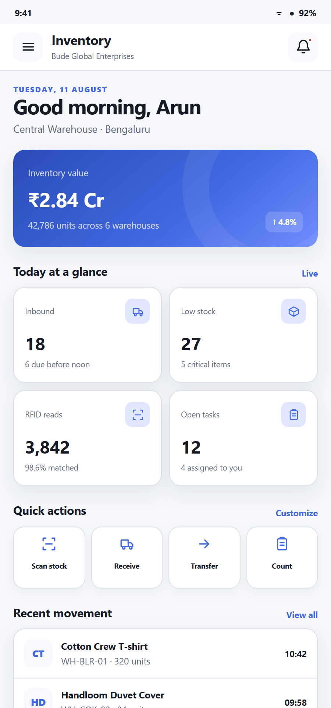<br><sub>Dashboard</sub></td>
<td align="center" width="20%">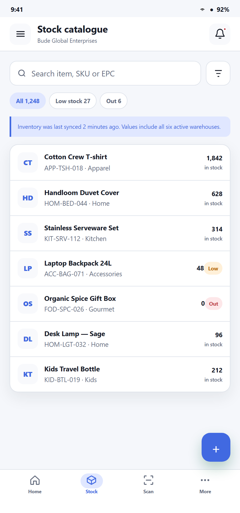<br><sub>Stock catalogue</sub></td>
<td align="center" width="20%">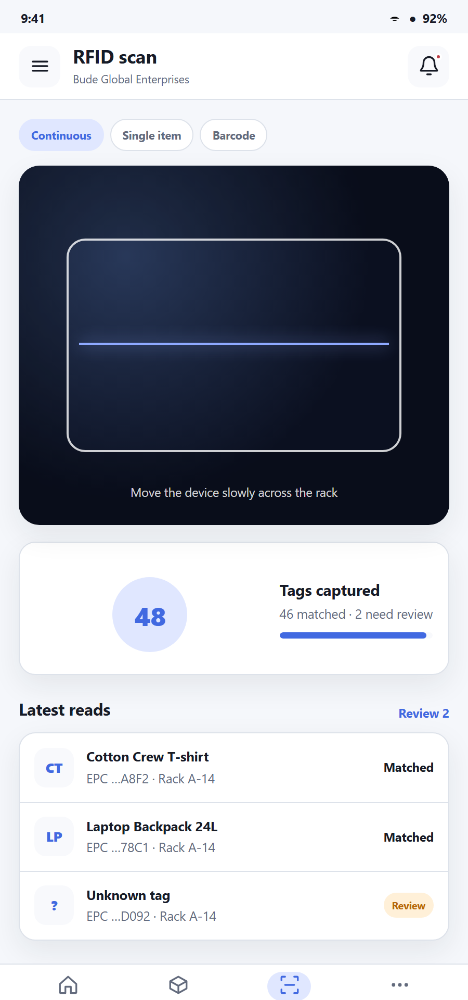<br><sub>RFID scan</sub></td>
<td align="center" width="20%">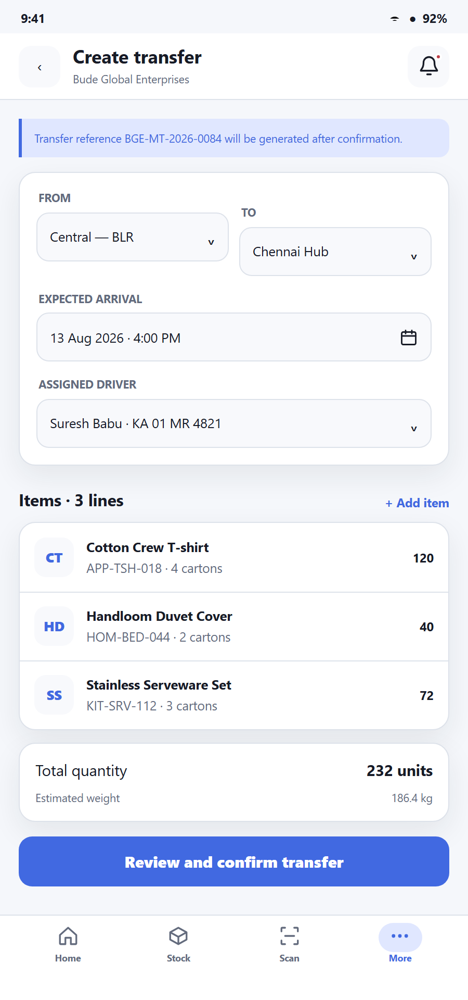<br><sub>Stock transfer</sub></td>
<td align="center" width="20%">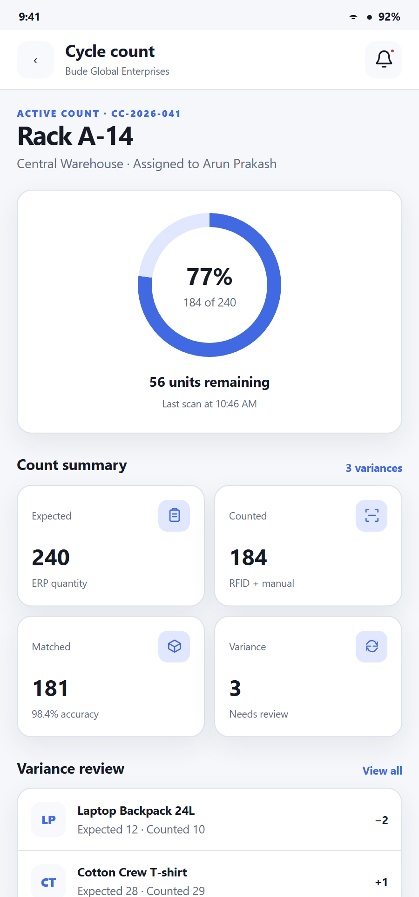<br><sub>Cycle count</sub></td>
</tr>
</table>

### HR

<table>
<tr>
<td align="center" width="25%">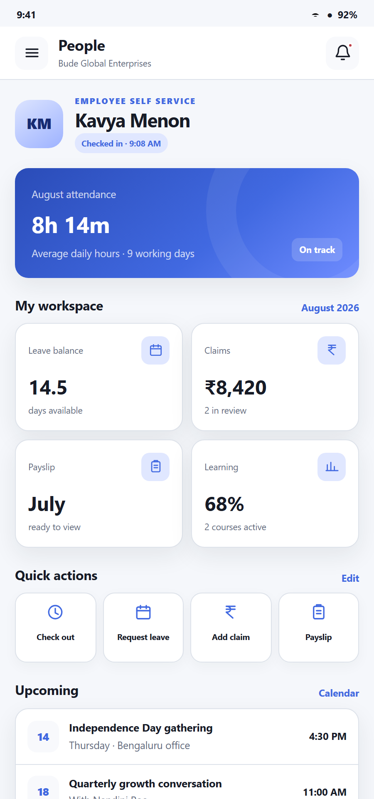<br><sub>Dashboard</sub></td>
<td align="center" width="25%">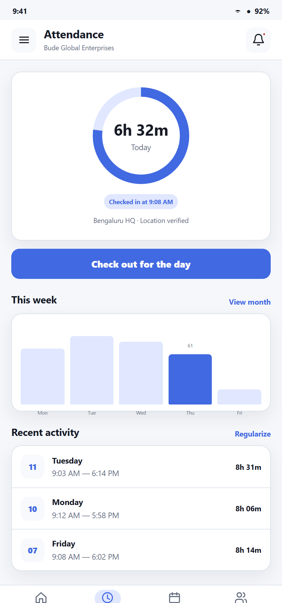<br><sub>Attendance</sub></td>
<td align="center" width="25%">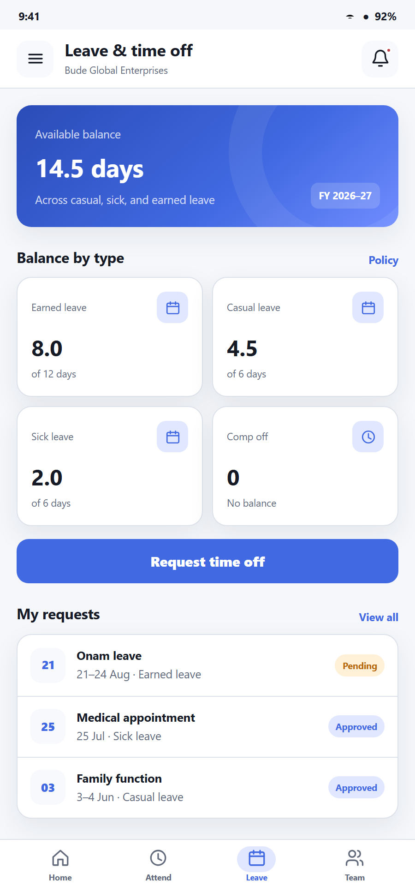<br><sub>Leave</sub></td>
<td align="center" width="25%">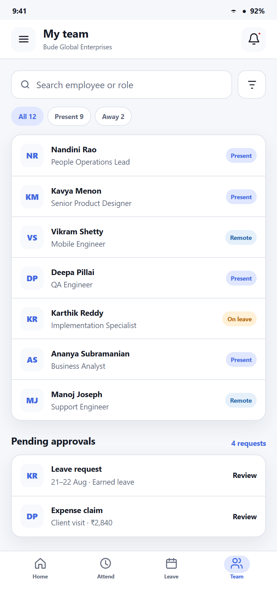<br><sub>Team</sub></td>
</tr>
</table>

### Sales

<table>
<tr>
<td align="center" width="25%">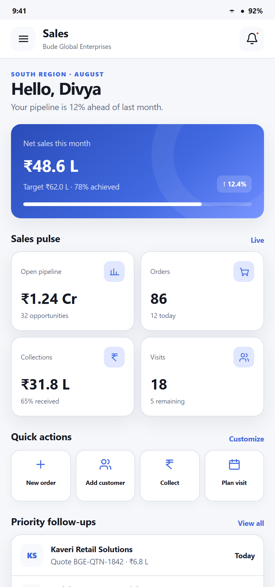<br><sub>Dashboard</sub></td>
<td align="center" width="25%">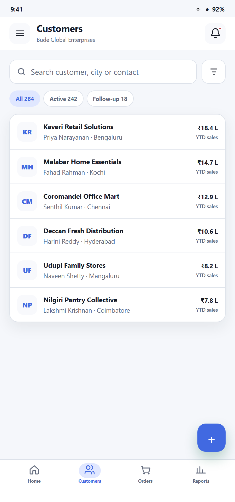<br><sub>Customers</sub></td>
<td align="center" width="25%">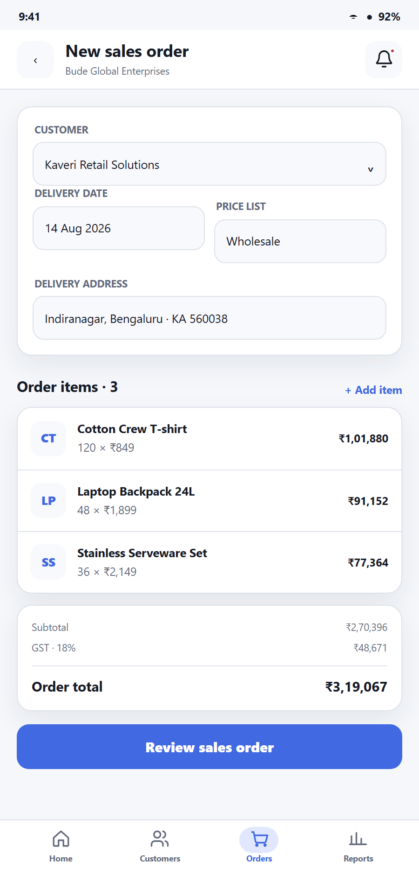<br><sub>New order</sub></td>
<td align="center" width="25%">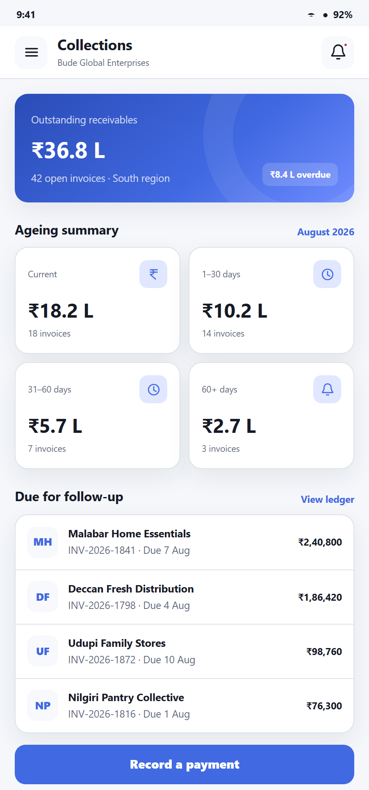<br><sub>Collections</sub></td>
</tr>
</table>

### Helpdesk

<table>
<tr>
<td align="center" width="25%">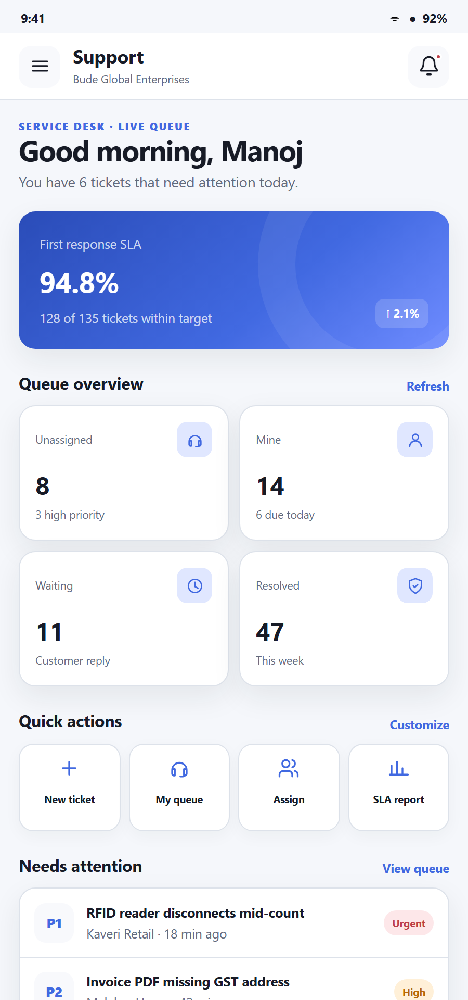<br><sub>Dashboard</sub></td>
<td align="center" width="25%">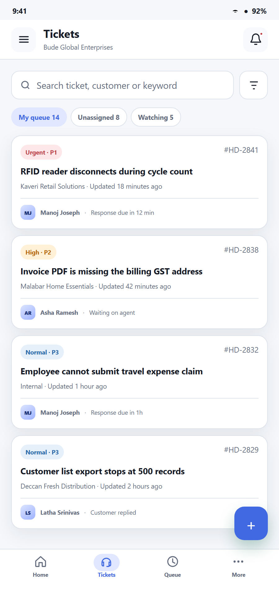<br><sub>Ticket queue</sub></td>
<td align="center" width="25%">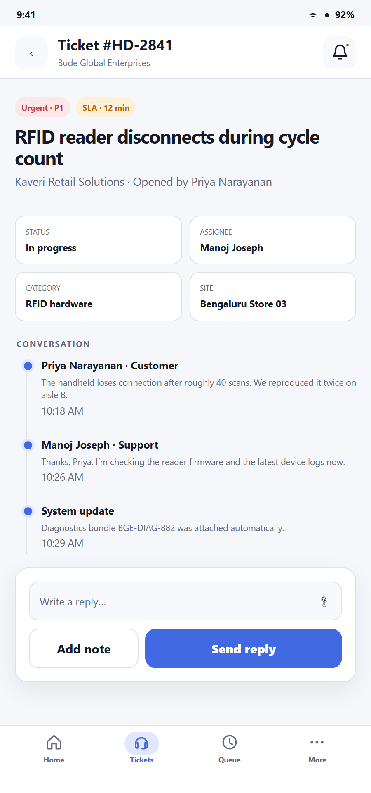<br><sub>Ticket detail</sub></td>
<td align="center" width="25%">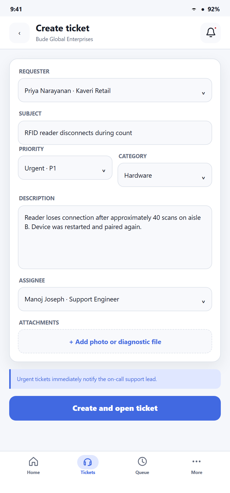<br><sub>New ticket</sub></td>
</tr>
</table>

### Sign-in & account

<table>
<tr>
<td align="center" width="25%">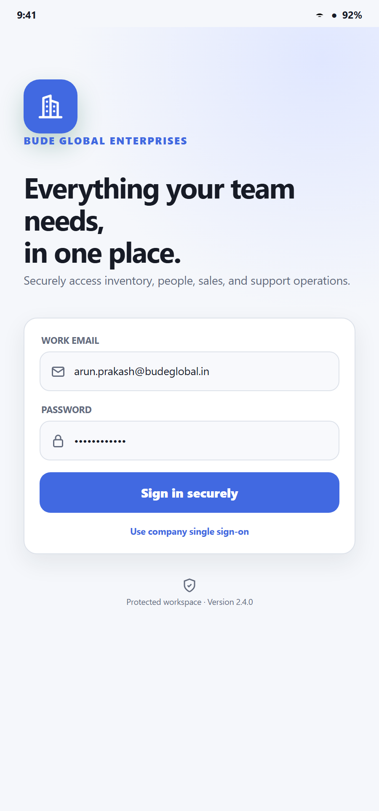<br><sub>Sign in</sub></td>
<td align="center" width="25%">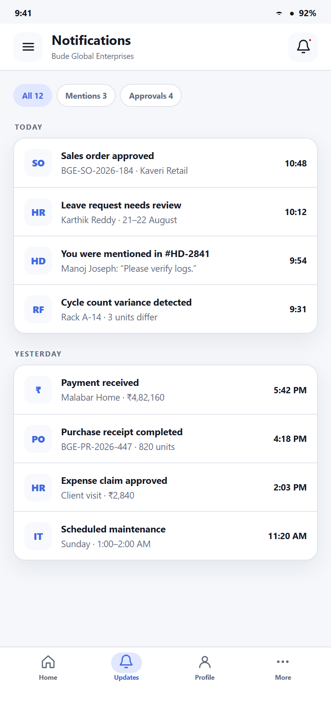<br><sub>Notifications</sub></td>
<td align="center" width="25%">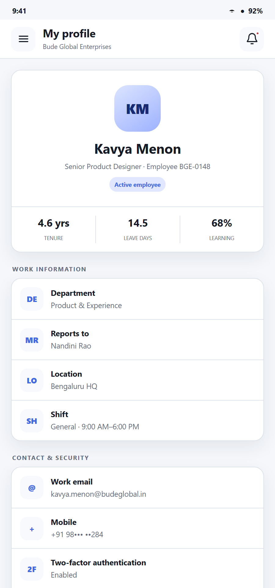<br><sub>Profile</sub></td>
</tr>
</table>

---

## Live demo

A public, read-only login on the pilot ERPNext site, for browsing the real
apps rather than the mockups above.

| | |
|---|---|
| Server URL | `https://erp1.budeglobal.in` |
| Username | `demo@budeglobal.in` |
| Password | `jVHoCW8igy1AvCjNBovv` |

> [!WARNING]
> **This account cannot write.** It holds the same operational roles a real
> Stock/HR/Sales/Helpdesk user would (so the apps' navigation renders
> normally), but every create, update, submit, delete and cancel is denied at
> the request level regardless of what those roles would otherwise allow —
> enforced in [`services/common/demo_readonly.py`](bude_api/services/common/demo_readonly.py),
> independent of the roles' own permissions, so real staff holding the same
> roles are unaffected. A handful of doctypes (Salary Slip, Payment Entry,
> User, and a few others) are blocked from this account even for reading.
> Anything not explicitly allow-listed is denied by default, including
> endpoints this file doesn't know about — see that module's docstring for
> what was tried first and why it didn't work.

> [!TIP]
> Use it to log into the web builds below, or point a fresh install of the
> mobile apps at that server URL.

### 🌐 Demo Web Builds (Try Online)

You can test all four Flutter applications directly in your browser:

| Application | Live Demo URL |
|---|---|
| **📦 Bude Inventory** | [demo-stock.budeglobal.in](https://demo-stock.budeglobal.in) |
| **👥 Bude HR** | [demo-hr.budeglobal.in](https://demo-hr.budeglobal.in) |
| **💼 Bude Sales** | [demo-sales.budeglobal.in](https://demo-sales.budeglobal.in) |
| **🎫 Bude Helpdesk** | [demo-helpdesk.budeglobal.in](https://demo-helpdesk.budeglobal.in) |

> [!NOTE]
> When prompted on first launch, use Server URL `https://erp1.budeglobal.in`, username `demo@budeglobal.in`, and password `jVHoCW8igy1AvCjNBovv`.

### Self-Hosted Demo Credentials & Setup

If you are self-hosting `bude_api` on your own Frappe / ERPNext server, you can create a safe, read-only demo user with a single bench command:

```bash
# From your frappe-bench directory:
bench --site <your-site> execute bude_api.demo.public_demo_user.ensure --args "['YourDemoPassword123']"
```

| Parameter | Value |
|---|---|
| **Demo Username** | `demo@budeglobal.in` |
| **Demo Password** | *(The password specified in the command above)* |
| **Operational Roles** | `Stock User`, `HR User`, `Sales User`, `Accounts User`, `Agent` |
| **Safety Guard** | Automatically restricted to read-only via `bude_api.services.common.demo_readonly` |

> [!TIP]
> **Safe by Design:** The demo user created on self-hosted instances is automatically restricted to read-only mode by `bude_api`'s `before_request` hook. You can safely share these demo credentials with testers or evaluators without risking your production or staging ERPNext database.

#### Seeding Sample Demo Data (Optional for Self-Hosters)

To populate your self-hosted test bench with realistic items, warehouses, employees, customers, and tickets for app testing:

```bash
# Seed realistic demo data into your test site:
bench --site <your-site> execute bude_api.demo.seed.run --kwargs "{'confirm_demo_data': True}"
```

---

## Status

Production-oriented API layer for the Bude inventory, HR, helpdesk, and sales
clients. The sales surface includes provider-neutral CRM, offline field work,
ERPNext order-to-cash, notification scheduling, and deployment diagnostics.

| Module | Purpose |
|---|---|
| `services/auth_service.py` | Wraps Frappe login/logout/session; token issuance |
| `services/erpnext_client.py` | Thin wrapper over Frappe ORM for standard DocTypes (Item, Stock Entry, Warehouse, etc.) |
| `api/health.py` | Whitelisted `ping` endpoint for client connectivity checks |
| `config/settings.py` | Reads environment + Frappe site_config values |

---

## Layout

```text
bude_api/
├── __init__.py
├── hooks.py                # Frappe app entrypoint
├── modules.txt
├── pyproject.toml          # package metadata for bench/pip
├── requirements.txt
├── config/
│   └── settings.py
├── services/
│   ├── auth_service.py
│   └── erpnext_client.py
├── api/
│   ├── auth.py
│   ├── health.py
│   └── items.py
├── middleware/
│   └── request_logger.py
├── utils/
│   └── response.py
└── tests/
    ├── test_auth.py
    ├── test_health.py
    └── test_items.py
```

---

## Install onto a Frappe bench

```bash
# from your frappe-bench directory
bench get-app bude_api https://github.com/BUDEGlobalEnterprise/bude-suite.git
bench --site <site> install-app bude_api
bench restart
```

> [!NOTE]
> Requires a running Frappe bench with ERPNext installed. The app registers
> itself through `hooks.py` and does not create any custom DocTypes.

---

## Calling endpoints

```
POST /api/method/login                            # Frappe built-in
GET  /api/method/bude_api.api.health.ping         # custom — returns service status
GET  /api/resource/Item?filters=[["disabled","=",0]]   # standard ERPNext REST
```

---

## Constraints

- No custom DocTypes.
- All persistence goes through ERPNext standard entities.
- Connectors for SAP / Zoho / other ERPs land under a future `integrations/` package using the Adapter pattern.

---

## Bude Sales CRM

The provider-neutral CRM API is exposed under
`/api/method/bude_api.api.sales_crm.*`. It uses standard ERPNext records by
default and can use Frappe CRM records when the optional `crm` app is installed
on the same site. A site always has one active provider; records are never
dual-written.

Add these keys to the site's `site_config.json`, then restart the bench:

```json
{
  "bude_sales_crm_enabled": 1,
  "bude_sales_crm_provider": "erpnext",
  "bude_sales_default_owner": "sales@example.com",
  "bude_sales_intake_secret": "replace-with-a-long-random-secret",
  "bude_sales_quote_response_secret": "use-a-separate-long-random-secret",
  "bude_sales_visit_max_accuracy_m": 100,
  "bude_sales_visit_geofence_m": 250,
  "bude_sales_commission_rate_percent": 2.5,
  "bude_sales_telemetry_enabled": 0,
  "bude_sales_plan": "pilot",
  "bude_sales_entitlement_status": "active"
}
```

> [!IMPORTANT]
> Use `"frappe_crm"` only after installing Frappe CRM on the same site. CRM is
> feature-flagged off when `bude_sales_crm_enabled` is absent. The bootstrap API
> describes the provider, statuses, stages, sources, territories, writable/custom
> fields, channel availability, and current-user capabilities.

Signed public intake sends compact JSON plus a current Unix `timestamp`, a hex
HMAC-SHA256 `signature` of `<timestamp>.<canonical-json>`, a channel key, and a
stable upstream `external_id`. Provider configuration, forms, email, assignment
rules, Meta, and optional WhatsApp setup remain in Frappe Desk; the mobile app
never stores connector credentials.

The CRM namespace includes bootstrap/capabilities, lead and deal CRUD,
duplicate and conversion choices, activities/timeline, tasks, private
attachments, provider-linked email, stage/outcome changes, quotation/order
handoff, analytics, manager bulk updates, connector health, and the signed
intake webhook. Mutations that can be replayed accept a stable
`client_request_id`; update operations accept `base_modified` and return a
`CONFLICT` response when the mobile revision is stale.

Attachments are stored as private standard `File` records, are permission
checked against their Lead/Opportunity/CRM parent, and are capped at 8 MB.
Outbound email creates a standard linked Communication through Frappe's mail
queue and refuses Lead records marked Do Not Contact.

Existing `Notification Log` fan-out recognizes these additional CRM
categories: lead assignment, task due/overdue, SLA breach, deal stage change,
and quotation expiry. Configure Firebase delivery and the existing device
registration endpoints to enable push transport; notification preferences are
per user.

> [!CAUTION]
> The public `capture_intake` endpoint is for trusted server-to-server connectors
> only. Keep `bude_sales_intake_secret` off every mobile client, use a fresh Unix
> timestamp and stable external ID, and sign the exact canonical JSON payload.

The separate quotation-response secret signs expiring accept/decline links.
Accepted responses are written exactly once to the standard Quotation timeline;
payment links are standard ERPNext Payment Requests. Do not reuse either public
endpoint secret for another integration.

> [!TIP]
> Run `bude_api.api.sales_crm.setup_doctor` after installation and upgrades. It
> checks the selected provider, required DocTypes, scheduler, secrets, connector
> capabilities, and role access without exposing credentials. The same report is
> available to System Managers in **More > Setup doctor** in the sales app.

The scheduler calls the CRM reminder worker every 15 minutes. It creates
permission-aware `Notification Log` records for assignment, overdue follow-up,
SLA, stage, and quotation-expiry events; configured push delivery fans them out
to registered devices. Telemetry is disabled by default and, when explicitly
enabled, records only sanitized feature counters in the site's Error Log.

Field visit check-in validates GPS accuracy and optional distance from the
customer address. Offline visits remain clearly marked as unverified until
synced. Tune the two distance settings for the operating environment rather
than lowering them simply to remove validation failures.

See [the commercial pilot runbook](docs/sales/bude-sales-commercial-pilot.md)
for rollout, permissions, acceptance criteria, support, and packaging.

---

## System Requirements

- **ERPNext:** v14 or later on a Frappe bench
- **Python:** 3.10+
- **Mobile Apps:** Flutter-built native apps (Android / iOS)
- **Hardware:** Optional RFID readers / barcode scanners for Inventory module
- **Connectivity:** Offline-first; syncs when network is available

---

## More documentation

- [Product overview](docs/PRODUCT.md) — the full showcase guide covering all four apps: workflows, hardware support, demo script, training labs
- [Roadmap](docs/roadmap/inventory.md) ([V2](docs/roadmap/inventory-v2.md)) — Inventory app
- [HR roadmap](docs/roadmap/hr.md) ([V2](docs/roadmap/hr-v2.md))
- [Architecture overview](docs/architecture/overview.md) · [development guidelines](docs/architecture/development-guidelines.md) · [Hardware Abstraction Layer design](docs/architecture/hal-design.md) · [service-cloud architecture](docs/architecture/bude_service_cloud_architecture.md) · [4-app ERPNext usability audit](docs/architecture/four-app-erpnext-usability-audit.md)
- [API standards](docs/api-specifications/api-standards.md)
- [Hardware integration roadmap](docs/hardware-roadmap/integration-roadmap.md)
- [Helpdesk market roadmap](docs/helpdesk/market-roadmap.md) and release notes: [0.3](docs/helpdesk/release-0.3.md) · [0.4](docs/helpdesk/release-0.4.md) · [0.5](docs/helpdesk/release-0.5.md)
- [Field sales market roadmap](docs/sales/field-sales-market-roadmap.md) · [commercial pilot runbook](docs/sales/bude-sales-commercial-pilot.md)
- [UI continuation notes](docs/ui/UI_CONTINUATION.md)
