# Bude Service Cloud Architecture

## Scope

Bude Service Cloud is a standalone Frappe custom app for AMC and field-service
operations. It must run beside ERPNext, HRMS, Frappe Helpdesk, `bude_api`, and
the existing RFID Inventory mobile platform without replacing their source-of-
truth records.

This document is the phase-zero audit and architecture output. No application
code should be generated before this design is reviewed.

## Existing System Audit

### ERPNext Sales

Reusable source-of-truth DocTypes:

- `Customer`, `Contact`, `Address`
- `Opportunity`, `Quotation`, `Sales Order`, `Delivery Note`
- `Sales Invoice`, `Payment Entry`
- `Sales Person`, `Sales Team`, `Territory`, `Company`

Existing local integration:

- `bude_api.api.sales_mobile.*` exposes customer search, customer 360, item
  search, quotation/order/invoice/payment creation, sales masters, dashboard,
  and team summary.
- `bude_api.api.sales.*` exposes legacy item price, customer list, order,
  invoice, and payment APIs.

Design decision:

- Bude Service Cloud must link to Sales documents and create renewal
  `Opportunity` / `Quotation` records through ERPNext APIs.
- It must not duplicate CRM conversations, price lists, sales teams, or payment
  ledgers.

### ERPNext Inventory, Assets, and RFID Inventory

Reusable source-of-truth DocTypes:

- `Item`, `Item Barcode`, `Serial No`, `Batch`, `Warehouse`, `Bin`
- `Stock Entry`, `Material Request`, `Purchase Receipt`
- `Asset`, `Asset Movement`, `Asset Repair`, `Asset Maintenance Log`
- `File`

Existing local integration:

- `bude_api.custom.rfid_fields` adds `bude_epc` Custom Field to `Asset`,
  `Serial No`, and `Item`.
- `bude_api.api.scan.resolve_epc` resolves scans by:
  `Asset.bude_epc -> Serial No.bude_epc -> Item.bude_epc -> Item Barcode`.
- `bude_api.api.assets.*` reads/writes standard ERPNext Asset records and asset
  maintenance records.
- `bude_api.api.stock.*` creates standard ERPNext `Stock Entry`, `Purchase
  Receipt`, and `Stock Reconciliation` documents.
- `bude_api.api.warehouse_tasks.list_open` already aggregates purchase orders,
  sales orders, asset maintenance logs, cycle counts, and ToDos.

Design decision:

- `Installed Equipment` should link to `Serial No` and/or `Asset`.
- RFID identity should be stored through the existing `bude_epc` field and
  resolved through a service boundary. Bude Service Cloud may add a field named
  `rfid_tag_id` for display/search, but canonical RFID lookup should delegate
  to the existing RFID API or read the same custom field through a compatibility
  adapter.
- Spare consumption must create ERPNext `Stock Entry`; Bude Service Cloud only
  stores work-order context, chargeability, and return status.

### HRMS

Reusable source-of-truth DocTypes:

- `Employee`, `User`, `Employee Checkin`
- `Leave Application`, `Attendance`
- `Shift Type`, `Shift Assignment`, `Holiday List`, `Holiday`

Existing local integration:

- `bude_api.api.hr.*` exposes employee profile, attendance, leave, shifts,
  manager approvals, and geofence-aware check-in helpers.
- Existing helpdesk field-service code maps a Helpdesk job check-in/check-out
  to `Employee Checkin` with `skip_auto_attendance=1`.

Design decision:

- `Technician Availability` should link to `Employee` and `User`, but leave,
  attendance, shifts, and holidays stay in HRMS.
- Service check-in/check-out should create service-scoped visit logs and may
  also create `Employee Checkin` with `skip_auto_attendance=1` for reporting.
  It must not distort HR attendance.

### Frappe Helpdesk

Reusable source-of-truth DocTypes:

- `HD Ticket`, `HD Ticket Priority`, `HD Ticket Status`, `HD Team`
- Helpdesk communication/message/comment/file records
- `HD Customer` with `erpnext_customer` bridge where available

Existing local integration:

- `bude_api.api.helpdesk.*` exposes requester tickets, agent tickets, detail,
  ticket creation, replies, comments, attachments, agents, and masters.
- `bude_api.api.field_service.*` currently layers basic field-service work on
  top of Helpdesk tickets: job site, check-in, check-out, visit completion.
- Existing field-service completion creates standard ERPNext `Maintenance Visit`
  when an ERPNext customer can be resolved and adds an internal Helpdesk
  comment.

Design decision:

- `Service Work Order` should link to one `HD Ticket` when generated from
  Helpdesk.
- Helpdesk conversation history must stay in Helpdesk. Bude Service Cloud should
  only write back lifecycle comments, status transitions, and service report
  links.

## Integration Map

| Existing DocType/API | New DocType | Relationship | Data ownership | Trigger / sync method |
|---|---|---|---|---|
| `Customer` | `Installed Equipment`, `AMC Contract`, `Service Work Order`, `AMC Renewal Opportunity` | Required Link | ERPNext owns customer master | Link validation on save; permission query filters by customer |
| `Contact` | `Installed Equipment`, `Service Work Order` | Optional Link | ERPNext owns contacts | Pulled from customer/address during creation |
| `Address` | `Installed Equipment`, `Service Work Order` | Optional Link | ERPNext owns address | Store Link plus rendered snapshot for reports only |
| `Item` | `Installed Equipment`, `Spare Part Consumption` | Required/optional Link | ERPNext owns item master | Item lookup and validation through ERPNext |
| `Serial No` | `Installed Equipment`, `Spare Part Consumption` | Optional Link | ERPNext owns serial identity | Validate serial belongs to item and warehouse when consumed |
| `Asset` | `Installed Equipment` | Optional Link | ERPNext owns asset accounting/location | Equipment may reference Asset for high-value tracked equipment |
| `Asset Maintenance Log` | `Maintenance Schedule`, `Service Work Order` | Optional source | ERPNext owns asset-maintenance source if used | Import/bridge open logs; do not duplicate completed logs |
| `bude_api.api.scan.resolve_epc` / `bude_epc` | `Installed Equipment` | Lookup/identity bridge | RFID Inventory owns scan resolver and EPC fields | API delegation for RFID lookup; optional custom field mapping |
| `Quotation` | `AMC Contract`, `AMC Renewal Opportunity` | Sales source / renewal quote | ERPNext owns quote | Button/action creates AMC after quote/order approval; renewal creates quote |
| `Sales Order` | `AMC Contract`, `Installed Equipment` | Commercial source | ERPNext owns order | Server action creates AMC/equipment from submitted sales flow |
| `Delivery Note` | `Installed Equipment` | Installation source | ERPNext owns delivery | Action creates equipment records from delivered serialized/assets rows |
| `Sales Invoice` | `AMC Contract` | Billing reference | ERPNext owns invoice | Linked on billing generation or manual association |
| `Payment Entry` | `Service Work Order`, `AMC Contract` | Payment source | ERPNext owns payment ledger | Service charge collection creates Payment Entry |
| `Opportunity` | `AMC Renewal Opportunity` | 1:1 optional Link | ERPNext owns opportunity | Scheduled expiry job creates opportunity idempotently |
| `Employee` | `Technician Availability`, `Service Work Order` | Technician identity | HRMS owns employee | Availability cache links to active employee |
| `User` | `Technician Availability`, assignments | Login identity | Frappe owns user | User permission and role filters |
| `Leave Application` | `Technician Availability`, `Service Work Order` | Conflict check | HRMS owns leave | Assignment validation checks approved/open leave |
| `Attendance`, `Employee Checkin` | `Service Work Order` | Reporting/check-in bridge | HRMS owns attendance; Service Cloud owns work-order visit state | Service check-in writes service timestamps and optional Employee Checkin |
| `Shift Type`, `Holiday List` | `Technician Availability` | Scheduling constraints | HRMS owns schedule policy | Availability calculation reads shifts/holidays |
| `HD Ticket` | `Service Work Order` | 0..1 Link | Helpdesk owns ticket and conversation | Ticket action creates work order; work-order status writes comments/status |
| `HD Ticket Priority`, `HD Ticket Status` | `Service Work Order` | Priority/status mapping | Helpdesk owns helpdesk semantics | Configurable mapping in Service Settings |
| `HD Team` | `Service Territory`, `Technician Availability` | Optional bridge | Helpdesk owns helpdesk team | Use for agent lookup; Service Cloud owns service territory |
| `Warehouse` | `Spare Part Consumption`, `Technician Availability` | Source warehouse | ERPNext owns warehouses | Validate technician source warehouse and stock |
| `Stock Entry` | `Spare Part Consumption` | Required Link after submit | ERPNext owns stock ledger | Work-order parts submit creates Stock Entry idempotently |
| `File` | Equipment photos, docs, service photos, signatures, reports | Attachment | Frappe owns file storage | Private files with doctype/name links and permission checks |

## Proposed New DocTypes

### Primary transactional/master DocTypes

- `Installed Equipment`
- `AMC Contract`
- `Maintenance Schedule`
- `Service Work Order`
- `Service Checklist Template`
- `Service Checklist Response`
- `Spare Part Consumption`
- `Technician Availability`
- `Service Territory`
- `AMC Renewal Opportunity`

### Child tables

- `Installed Equipment Photo`
- `Installed Equipment Document`
- `AMC Covered Equipment`
- `AMC Covered Service`
- `AMC Included Spare Part`
- `AMC Excluded Spare Part`
- `Maintenance Schedule Rule` if multiple rules per contract are required later
- `Service Work Order Required Part`
- `Service Work Order Required Tool`
- `Service Work Order Consumed Part`
- `Service Work Order Photo`
- `Service Checklist Template Item`
- `Service Checklist Response Item`
- `Technician Skill`
- `Technician Equipment Category`
- `Service Territory Postal Code`
- `Service Territory Technician`
- `Service Status History`
- `Service Assignment History`
- `Notification Channel Setting`

### Settings and supporting DocTypes

- `Bude Service Cloud Settings`
- `Service Type`
- `Equipment Category`
- `Service SLA`
- `Service Notification Provider`

## Database Relationship Diagram

```mermaid
erDiagram
    CUSTOMER ||--o{ INSTALLED_EQUIPMENT : owns
    CUSTOMER ||--o{ AMC_CONTRACT : signs
    CUSTOMER ||--o{ SERVICE_WORK_ORDER : requests
    CONTACT ||--o{ INSTALLED_EQUIPMENT : contact
    ADDRESS ||--o{ INSTALLED_EQUIPMENT : location
    ITEM ||--o{ INSTALLED_EQUIPMENT : model_item
    SERIAL_NO ||--o| INSTALLED_EQUIPMENT : identifies
    ASSET ||--o| INSTALLED_EQUIPMENT : capital_asset
    SALES_ORDER ||--o{ INSTALLED_EQUIPMENT : delivered_from
    DELIVERY_NOTE ||--o{ INSTALLED_EQUIPMENT : installed_from

    AMC_CONTRACT ||--o{ AMC_COVERED_EQUIPMENT : covers
    INSTALLED_EQUIPMENT ||--o{ AMC_COVERED_EQUIPMENT : covered
    AMC_CONTRACT ||--o{ MAINTENANCE_SCHEDULE : creates
    AMC_CONTRACT ||--o{ SERVICE_WORK_ORDER : covers
    AMC_CONTRACT ||--o{ AMC_RENEWAL_OPPORTUNITY : renews
    OPPORTUNITY ||--o| AMC_RENEWAL_OPPORTUNITY : crm_pipeline
    QUOTATION ||--o| AMC_RENEWAL_OPPORTUNITY : renewal_quote

    MAINTENANCE_SCHEDULE ||--o{ SERVICE_WORK_ORDER : generates
    INSTALLED_EQUIPMENT ||--o{ SERVICE_WORK_ORDER : serviced
    HD_TICKET ||--o| SERVICE_WORK_ORDER : source_ticket
    EMPLOYEE ||--o{ TECHNICIAN_AVAILABILITY : availability
    EMPLOYEE ||--o{ SERVICE_WORK_ORDER : assigned_technician
    SERVICE_TERRITORY ||--o{ TECHNICIAN_AVAILABILITY : region
    SERVICE_TERRITORY ||--o{ SERVICE_WORK_ORDER : dispatch_area

    SERVICE_CHECKLIST_TEMPLATE ||--o{ SERVICE_CHECKLIST_TEMPLATE_ITEM : defines
    SERVICE_CHECKLIST_TEMPLATE ||--o{ SERVICE_WORK_ORDER : selected_for
    SERVICE_WORK_ORDER ||--o{ SERVICE_CHECKLIST_RESPONSE : responses
    SERVICE_CHECKLIST_RESPONSE ||--o{ SERVICE_CHECKLIST_RESPONSE_ITEM : answers

    SERVICE_WORK_ORDER ||--o{ SPARE_PART_CONSUMPTION : consumes
    ITEM ||--o{ SPARE_PART_CONSUMPTION : spare_item
    WAREHOUSE ||--o{ SPARE_PART_CONSUMPTION : source
    STOCK_ENTRY ||--o{ SPARE_PART_CONSUMPTION : posts_stock
    FILE ||--o{ SERVICE_WORK_ORDER : photos_signatures_reports
```



## Conflict and Duplication Risks

1. `Maintenance Visit` versus `Service Work Order`
   - Existing field-service code creates ERPNext `Maintenance Visit`.
   - Bude Service Cloud needs richer technician, checklist, signature, stock,
     portal, and AMC controls. Keep `Service Work Order` as source of service
     execution. Optionally create or link `Maintenance Visit` for ERPNext
     compatibility, but do not rely on it as the primary operational record.

2. `Asset Maintenance Log` versus `Maintenance Schedule`
   - ERPNext already has asset maintenance scheduling.
   - Service Cloud schedule should focus on AMC/customer commitments and
     technician dispatch. It can import/link existing logs but should not
     overwrite ERPNext asset-maintenance semantics.

3. Helpdesk ticket status versus service status
   - Helpdesk statuses belong to support triage; work-order statuses belong to
     dispatch and execution.
   - Use configurable status mapping, not hardcoded assumptions.

4. HR attendance versus service check-in
   - Service check-ins should not become payroll attendance.
   - Use service timestamps on `Service Work Order`; optional `Employee Checkin`
     rows must set `skip_auto_attendance=1`.

5. RFID ownership
   - Existing `bude_epc` fields and scan resolver are owned by RFID Inventory.
   - Service Cloud should integrate through an adapter API/hook, avoiding a hard
     import dependency unless the app is installed.

6. Spare-part inventory
   - Do not store balances in Service Cloud.
   - `Spare Part Consumption` must be context/audit only; `Stock Entry` remains
     inventory source of truth.

7. Customer portal data leakage
   - Frappe portal users can have multiple contact/customer links.
   - Every portal query must resolve allowed customers server-side and filter by
     customer, not client input.

## Proposed File Structure

```text
apps/bude_service_cloud/
  pyproject.toml
  README.md
  bude_service_cloud/
    __init__.py
    hooks.py
    modules.txt
    patches.txt
    config/
      desktop.py
      docs.py
    bude_service_cloud/
      doctype/
        bude_service_cloud_settings/
        installed_equipment/
        installed_equipment_photo/
        installed_equipment_document/
        amc_contract/
        amc_covered_equipment/
        amc_covered_service/
        amc_spare_part_rule/
        maintenance_schedule/
        service_work_order/
        service_work_order_required_part/
        service_work_order_photo/
        service_checklist_template/
        service_checklist_template_item/
        service_checklist_response/
        service_checklist_response_item/
        spare_part_consumption/
        technician_availability/
        technician_skill/
        service_territory/
        service_territory_postal_code/
        service_territory_technician/
        amc_renewal_opportunity/
        service_sla/
        service_type/
        equipment_category/
      report/
        amc_expiry_report/
        preventive_maintenance_compliance/
        technician_performance/
        sla_breach_report/
        equipment_service_history/
        spare_part_consumption_report/
      page/
        service_manager_dashboard/
        technician_dashboard/
        amc_dashboard/
      web_form/
        customer_service_request/
      templates/
        pages/
          customer_service_portal.html
        print_formats/
          service_report/
      api/
        technician.py
        work_order.py
        equipment.py
        portal.py
        dispatch.py
      integrations/
        sales.py
        helpdesk.py
        hrms.py
        inventory.py
        rfid.py
        notifications.py
      jobs/
        preventive.py
        amc.py
        sla.py
        notifications.py
      permissions.py
      workflows.py
      validators.py
      utils/
        responses.py
        idempotency.py
        files.py
        dates.py
    public/
      js/
        service_work_order.js
        amc_contract.js
        installed_equipment.js
      css/
        service_cloud.css
    fixtures/
      role.json
      workflow.json
      custom_field.json
      property_setter.json
      print_format.json
    tests/
      test_installed_equipment.py
      test_amc_contract.py
      test_service_work_order.py
      test_checklist.py
      test_spare_part_consumption.py
      test_helpdesk_integration.py
      test_rfid_lookup.py
      test_permissions.py
      test_portal.py
      test_jobs.py
```

## Workflow Architecture

### Sales to Installation

1. Submitted `Sales Order` or `Delivery Note` action calls
   `bude_service_cloud.integrations.sales.create_installed_equipment`.
2. Server validates serialized/assets rows and customer.
3. Creates `Installed Equipment` linked to `Customer`, `Item`, `Serial No`,
   `Asset`, `Sales Order`, and `Delivery Note`.
4. Activates warranty dates based on item/category/company policy.
5. Optionally creates first `Maintenance Schedule` if AMC or warranty plan
   requires preventive visits.

### Helpdesk to Service

1. Helpdesk agent opens action "Create Service Work Order".
2. Service Cloud resolves `HD Ticket -> HD Customer -> ERPNext Customer`.
3. User selects or scans `Installed Equipment`.
4. Server verifies warranty/AMC coverage and duplicate open work orders.
5. Creates `Service Work Order` linked to `HD Ticket`.
6. Work-order lifecycle writes internal Helpdesk comments and final report link.
7. Helpdesk ticket close is optional and configurable.

### AMC Lifecycle

1. Quotation/Sales Order creates or references `AMC Contract`.
2. Contract activation validates dates, customer, covered equipment, value, and
   planned visits.
3. Activation creates `Maintenance Schedule` rows.
4. Scheduled job creates preventive `Service Work Order` records idempotently.
5. Expiry job updates contract status and creates `AMC Renewal Opportunity`.
6. Renewal opportunity can create ERPNext `Opportunity` and `Quotation`.

### Technician Execution

1. Technician sees assigned jobs through mobile API / responsive Frappe route.
2. Starts travel, then checks in.
3. Completes mandatory checklist, uploads before/after photos, records parts,
   resolution, signatures, and payment if applicable.
4. Completion validator blocks closure until mandatory data is present.
5. Submit completion creates stock entries, final report PDF, status history,
   Helpdesk update, customer notification, and next schedule calculation.

## Permission Model

- Use Frappe roles from the request as fixtures.
- Use document-level `has_permission` and query filters:
  - Field Technicians: assigned `Service Work Order` only.
  - Customer Portal Users: equipment, contracts, visits, reports for linked
    customers only.
  - Service Coordinators: work-order creation/scheduling.
  - Service Managers: approvals, analytics, exceptional charges.
  - AMC Executives: AMC lifecycle and renewal records.
- Sensitive commercial fields on `AMC Contract` must be hidden from technicians
  and portal users through field-level permissions and API serializers.

## API Architecture

All APIs return a consistent envelope:

```json
{"ok": true, "data": {}, "message": null}
```

or:

```json
{"ok": false, "code": "VALIDATION_REQUIRED", "message": "...", "data": null}
```

Initial APIs:

- `technician.jobs`
- `technician.work_order_detail`
- `technician.check_in`
- `technician.check_out`
- `technician.submit_checklist`
- `technician.upload_photo`
- `technician.upload_signature`
- `technician.record_spare_part`
- `technician.complete_work_order`
- `equipment.lookup`
- `equipment.lookup_by_rfid`
- `portal.create_service_request`
- `dispatch.technician_availability`
- `dispatch.reassign_work_order`

Security rules:

- Verify session and role.
- Verify document ownership or assignment.
- Use idempotency key for check-in, check-out, checklist submission, stock
  consumption, and completion.
- Validate file extensions, size, privacy, and attached document access.
- Do not expose raw Helpdesk conversations through service APIs.

## Scheduled Jobs

Configure in `hooks.py`:

- Hourly:
  - detect SLA breaches
  - send unresolved escalation alerts
  - sync overdue work-order statuses
- Daily:
  - create preventive work orders
  - update warranty statuses
  - update AMC statuses
  - create renewal opportunities at 90/60/30/15/7 days
  - send technician daily schedules
  - send customer appointment reminders

All jobs must be idempotent and use unique keys:

- schedule + due date + equipment
- contract + reminder threshold
- work order + event type

## Phase Plan

### Phase 1: Foundation

Deliver:

- App scaffold and install metadata.
- Roles, module, workspace, basic settings.
- DocTypes: `Installed Equipment`, `AMC Contract`, `Service Territory`.
- Child tables for equipment attachments and AMC coverage.
- Basic permissions and document-level query filters.
- Server validations for date ranges, covered equipment, customer links, and
  warranty dates.
- Tests for DocType validation and permission basics.

Exit criteria:

- App installs on ERPNext 15 bench.
- `bench migrate` creates all Phase 1 DocTypes.
- Service roles exist and baseline tests pass.

### Phase 2: Service Operations

Deliver:

- `Service Work Order`, checklist templates/responses, technician assignment,
  photos, signatures, status history, assignment history.
- Workflow transitions for requested work-order statuses.
- Mobile-first Frappe forms and technician route.
- Service report print format/PDF generation.
- Completion validation.

Exit criteria:

- Assigned technician can complete an end-to-end service visit.
- Closure is blocked until checklist, resolution, photos/signature/check-out
  rules are satisfied.

### Phase 3: Integrations

Deliver:

- Sales actions from Sales Order/Delivery Note to Installed Equipment.
- Helpdesk action to create Service Work Order.
- HRMS leave/availability conflict checks.
- RFID lookup adapter against existing `bude_api` scan resolver / `bude_epc`.
- Spare-part consumption with ERPNext `Stock Entry`.

Exit criteria:

- No duplicated customer, ticket, stock, employee, or RFID master data.
- Integration tests cover Sales, Helpdesk, HRMS, RFID, and Stock Entry paths.

### Phase 4: Automation

Deliver:

- Preventive maintenance generation.
- AMC expiry status updates and reminders.
- Renewal opportunity creation.
- SLA breach detection.
- Notification provider interface with Email/Frappe notification default and
  SMS/WhatsApp hooks.

Exit criteria:

- Jobs are idempotent.
- Re-running jobs does not create duplicates.
- Notifications are configurable, not provider-hardcoded.

### Phase 5: Portal and Mobile

Deliver:

- Customer portal: equipment, warranty/AMC, service request, visit schedule,
  report downloads, feedback.
- Technician mobile-first interface.
- Barcode/RFID lookup in technician flow.
- Offline MVP: assigned work-order details, checklist draft, notes, photos,
  signature, check-in/check-out timestamps queued locally.

Exit criteria:

- Portal user cannot access another customer.
- Technician can complete a job on mobile-sized screens.

### Phase 6: Analytics and Production Readiness

Deliver:

- Manager, technician, and AMC dashboards.
- Reports listed in the request.
- Expanded automated test suite.
- Performance indexes/query optimization.
- Full documentation: install, config, admin, coordinator, technician, portal,
  API, integrations, troubleshooting, backup/restore, upgrade/migration.

Exit criteria:

- Report filters/export work.
- No critical permission leakage.
- Deployment documentation is complete.

## MVP Boundary

Include:

- Installed Equipment
- AMC Contract
- Service Work Order
- Technician assignment
- Warranty/AMC verification
- Helpdesk ticket integration
- Preventive-maintenance scheduling
- Service checklist
- Before/after photos
- Customer signature
- Spare-part consumption through Stock Entry
- Service report PDF
- AMC expiry reminders
- Basic dashboards
- Customer portal service request

Exclude from MVP:

- AI assistance
- Route optimization
- Payroll/accounting replacements
- Complex offline conflict synchronization
- Provider-specific SMS/WhatsApp hardcoding

## Immediate Risks Before Coding

1. Confirm target bench has ERPNext, HRMS, Helpdesk app names and versions.
2. Confirm whether `bude_api` is always installed with Bude Service Cloud or
   whether RFID must be optional.
3. Confirm naming convention for custom DocTypes: prefix labels with "Bude" or
   use clean business names under Bude Service Cloud module.
4. Confirm whether ERPNext `Maintenance Visit` must be created for every service
   work order or only as an optional compatibility record.
5. Confirm customer portal authentication model and customer-contact mapping.
6. Confirm whether service reports require statutory/tax content or only work
   completion evidence.
